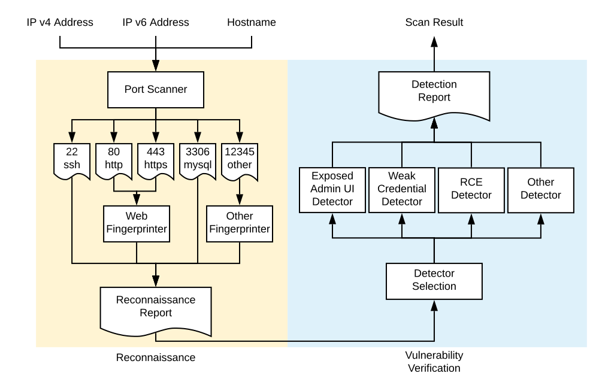

Tsunami is a general purpose network security scanner with an extensible plugin system for detecting high severity vulnerabilities with high confidence. 

It follows a hardcoded 2-step process when scanning a publicly exposed network endpoint:
1. Reconnaissance:
    - **Port Scanning Phase**: Tsunami performs port sweeping in order to identify open ports, protocols and network services on the scan target.
    - **Fingerprinting Phase**: Usually port scanners only provide very basic service detection capability. When the scan target hosts complicated network services, like web servers, the scanner needs to perform further fingerprinting work to learn more about the exposed network services.
2. Vulnerability verification
    - **Vulnerability Verification Phase**: Tsunami executes the vulnerability verification plugins in parallel to verify certain vulnerabilities on the scan target based on the information gathered in the Reconnaissance step.

Following diagram shows the overall workflow for a Tsunami scan:

